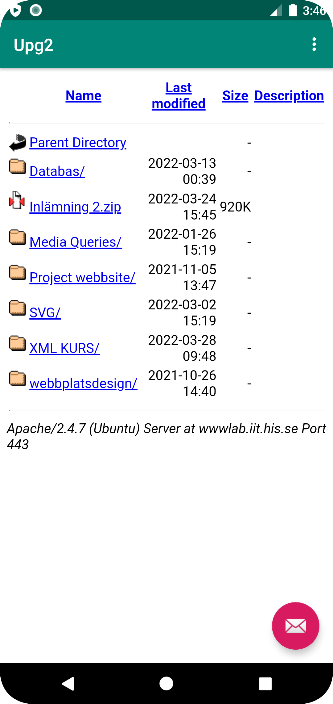
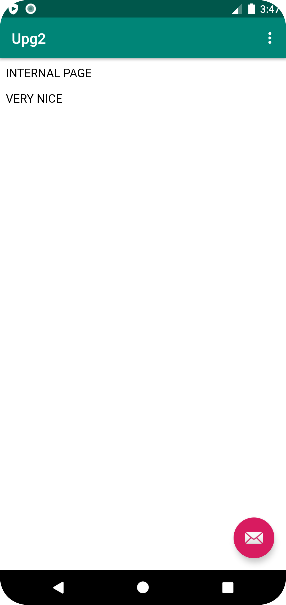

# Rapport

**Skriv din rapport här!**

Föst så ändrades namnet via values/strings.xml i stringen name="app_name" så lades Upg2 till
När namnet blivit anpassat så att internet fungerar, detta är gjort i manifests/androidManifest.xml, detta är gjort med uses-permission android:name="android.permission.INTERNET"
För att kunna hämta funktionen för webview så skapades ett id för den vid namn my_weview i content_main.xml, som även fick ärva width och height av parentselements, efter det så loakliserade vi webview med findViewById och döpte den till myWebView. efter det så enabla vi javascript, laddad in start url och skapade en new webviewclient för att kunna browsa internett på appen.
slutligen så implementades två funktioner med urler, en för external use och en för internal. För att göra det så skapdes en void funktion utanför där vi hämtade urlerna med loadurl, dem fick namn passande för funktion. Viktigt att declarera WebView myWebView; i början av elementet och att importa webkit för webview
För att välja mellan external och internal så är det två if funktioner så återkallar void funktionerna vi skapade tidigare för vilken website vi ska öppna.


```
<WebView
        android:id="@+id/my_webview"
        android:layout_width="match_parent"
        android:layout_height="match_parent"/>

public class MainActivity extends AppCompatActivity {

    WebView myWebView;

    public void showExternalWebPage(){
        // TODO: Add your code for showing external web page here
        myWebView.loadUrl("https://wwwlab.iit.his.se/b21ricni/");
    }

    public void showInternalWebPage(){
        // TODO: Add your code for showing internal web page here
        myWebView.loadUrl("file:///android_asset/about.html");
    }

    ..............................................
    kod som inte ändrats mellan Övre och undre kod
    ..............................................


        myWebView =findViewById(R.id.my_webview);
        myWebView.getSettings().setJavaScriptEnabled(true);
        myWebView.loadUrl("file:///android_asset/about.html");
        myWebView.setWebViewClient(new WebViewClient());

    ...................
    More unchanged code
    ...................

    if (id == R.id.action_external_web) {
                Log.d("==>","Will display external web page");
                showExternalWebPage();
                return true;
            }

            if (id == R.id.action_internal_web) {
                Log.d("==>","Will display internal web page");
                showInternalWebPage();
                return true;
            }

```



Läs gärna:

- Boulos, M.N.K., Warren, J., Gong, J. & Yue, P. (2010) Web GIS in practice VIII: HTML5 and the canvas element for interactive online mapping. International journal of health geographics 9, 14. Shin, Y. &
- Wunsche, B.C. (2013) A smartphone-based golf simulation exercise game for supporting arthritis patients. 2013 28th International Conference of Image and Vision Computing New Zealand (IVCNZ), IEEE, pp. 459–464.
- Wohlin, C., Runeson, P., Höst, M., Ohlsson, M.C., Regnell, B., Wesslén, A. (2012) Experimentation in Software Engineering, Berlin, Heidelberg: Springer Berlin Heidelberg.
